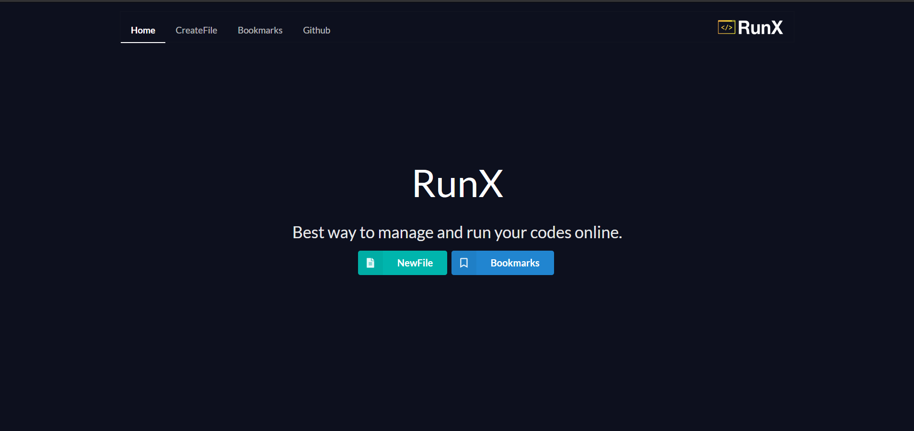
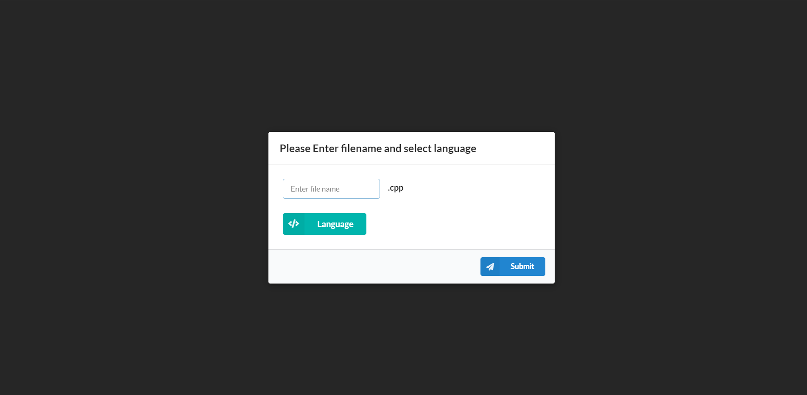
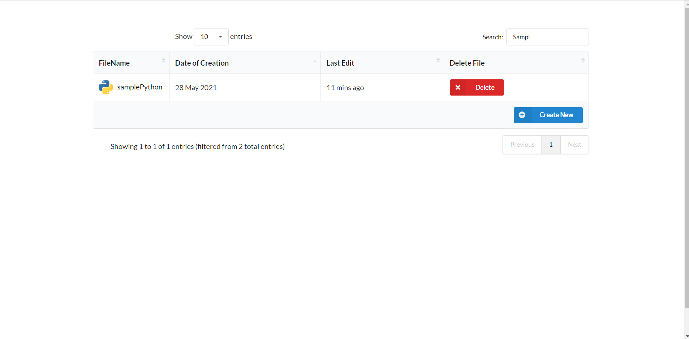

# RunX
Online compiler for competitive programmers and all the coding enthusiasts.
## Features
* 👉 Use it as simple compiler
* 👉 Solve single problem or all the problems of any contest in a single window.
* 👉 Automatic test case integration (No need to copy paste sample test cases and run them individually). 
* 👉 Compare your output with the sample test case output.
* 👉 Check your saved files in the bookmarks tab.
* 👉 Search and sort files by various parameters.
## Supported Languages
* C
* C++
* Java
* Python
## Video

## ScreenShots
### HomePage

### CreateFile

### Theme
* Default

* Sublime

* Light

### Bookmarks

## Star this repo if you liked this project.
